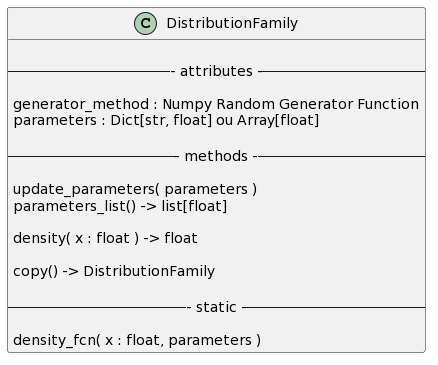
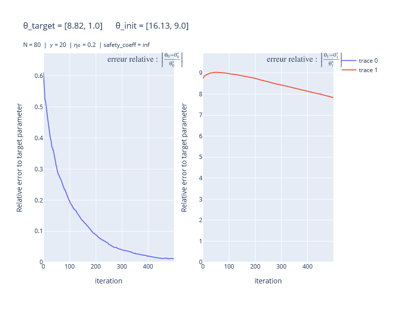
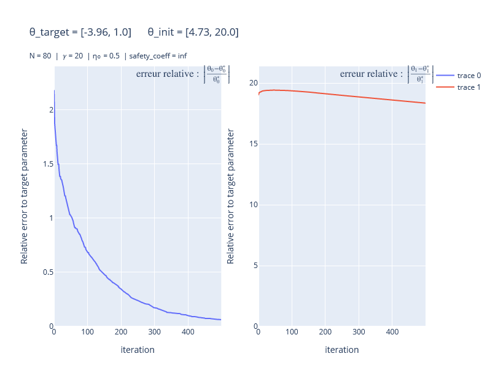
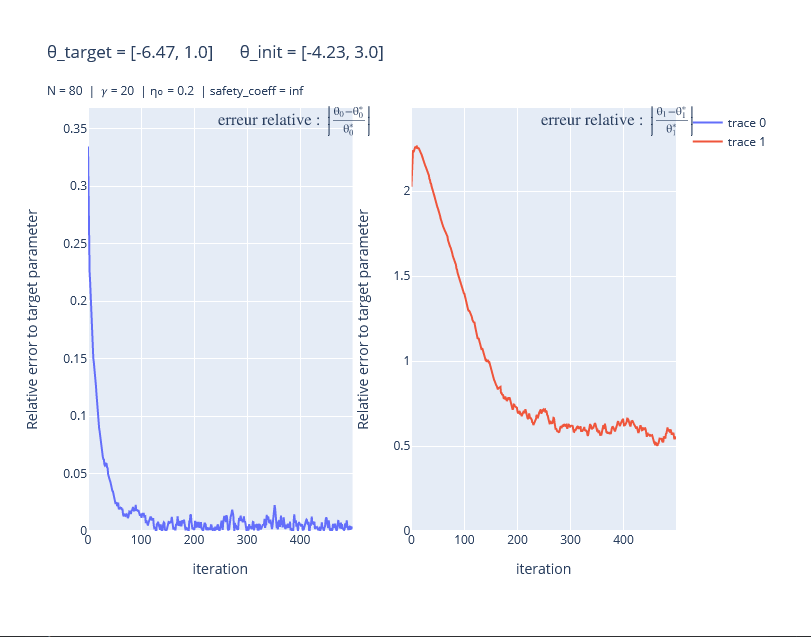

# ENSAI 3A Projet Methodologie-wAIS

<a  href="https://www.latex-project.org/">
    
</a>
<a  href="./rapport/bibliography/bibliography.bib">
    
</a>

<a  href="https://github.com/allemand-instable/ENSAI-3A-Projet-Methodologie-wAIS/releases/">
    
</a>
<a  href="https://www.python.org/downloads/release/python-3110/">
    
</a>

## avant-propos

> Le code a été depuis restructuré, pour une meilleure compréhension, les résultats et logs ont été déplaces dans d'autres dossiers. Les logs ont été conservés, par soucis de conservation historique des problèmes qui ont surgis lors du projet, si quelqu'un souhaite lui même investiguer le débogage des problèmes.
>
> Il se pourrait que le code fournisse quelques erreurs lorsque l'on essaye de le faire tourner aujourd'hui car les dossiers de résultat ont été déplacés, si une modification du code est envisageable, elle n'est pas aujourd'hui une de mes priorités. Le code était toutefois fonctionnel au moment du commit qui précède le dernier en date si quelqu'un souhaite le faire tourner sans efforts supplémentaires

## Ce qui est implémenté :

### Gradient de la vraissemblance de Kullback Leibler

$$\displaystyle{\widehat{\nabla L}(θ) = \frac 1 N \displaystyle\sum_{i = 1}^N \omega_\theta(X_i) \times h_\theta(X_i)}$$


avec :

- $\omega_\theta : x \mapsto \frac{f(x)}{q_\theta(x)}$
- $h_\theta : x \mapsto \nabla_\theta \ \log q_\theta(x)$

### Gradient

calcul de 
$$\displaystyle{\nabla_{x_k} f(x_i)_{1,n}}$$


pour $x_i \in \mathbb R^{k_i}$

$$\displaystyle{f : \begin{array}{ccc} \prod\limits_i \mathbb R^{k_i} &\longrightarrow& \mathbb R \\ (x_i)_{1,n} &\longmapsto& y \end{array}}$$


### famille de distribution

$f$ est un objet `DistributionFamily` :

ceci permet d'ajouter de la flexibilité concernant le calcul du gradient : on peut même mélanger deux familles de distributions du moment que l'on fournit bien les densités.



## les résultats actuels :





## Structure du code Python

### organisation des fichiers

```
📦methodo_wAIS_python
 ┃
 ┣ 📂calcul_approx
 ┃ ┣ 📜importance_sampling.py
 ┃ ┣ 📜wAIS.py
 ┃ ┗ 📜weighted_importance_sampling.py
 ┃ 
 ┣ 📂distribution_family
 ┃ ┣ 📜[distribution_family.py]
 ┃ ┣ 📜normal_family.py
 ┃ ┣ 📜binomial_family.py
 ┃ ┗  (...)
 ┃ 
 ┣ 📂gradient
 ┃ ┣ 📜gradient.py
 ┃ 
 ┣ 📂kullback_leibler
 ┃ ┗ 📜[sga_sequential.py]
 ┃ 
 ┣ 📂log
 ┃ ┣ 📜debug.log
 ┃ ┗ 📜info.log
 ┃
 ┣ 📂test
 ┃ ┣ 📜gradient.py
 ┃ ┗ 📜SGA_seq.py
 ┃ 
 ┣ 📂utils
 ┃ ┣ 📜log.py
 ┃ ┗ 📜print_array_as_vector.py
 ┃
 ┣ 📜[main.py]
 ┗ 📜run_test.py
  ```
