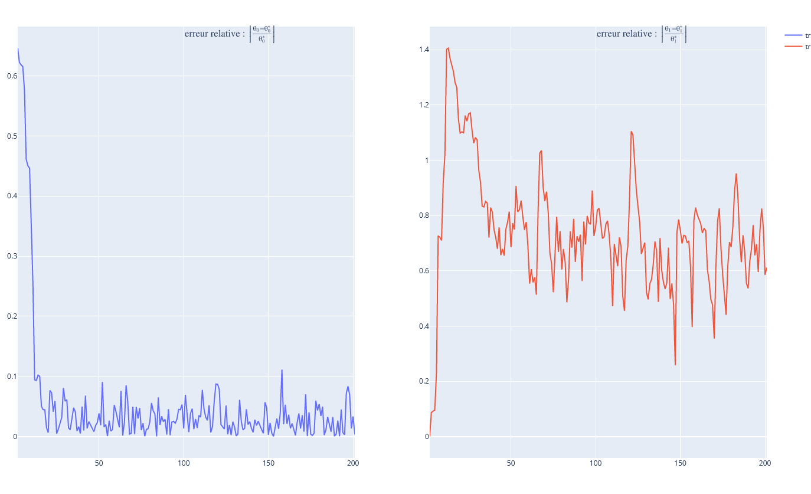
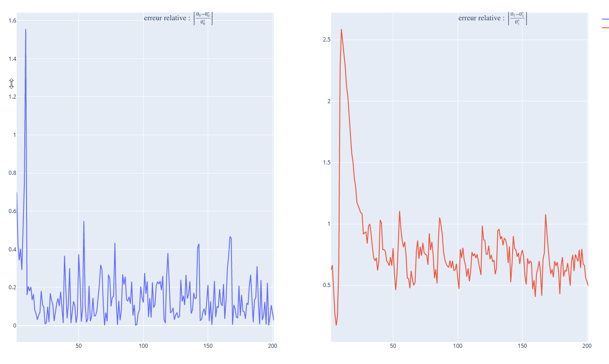
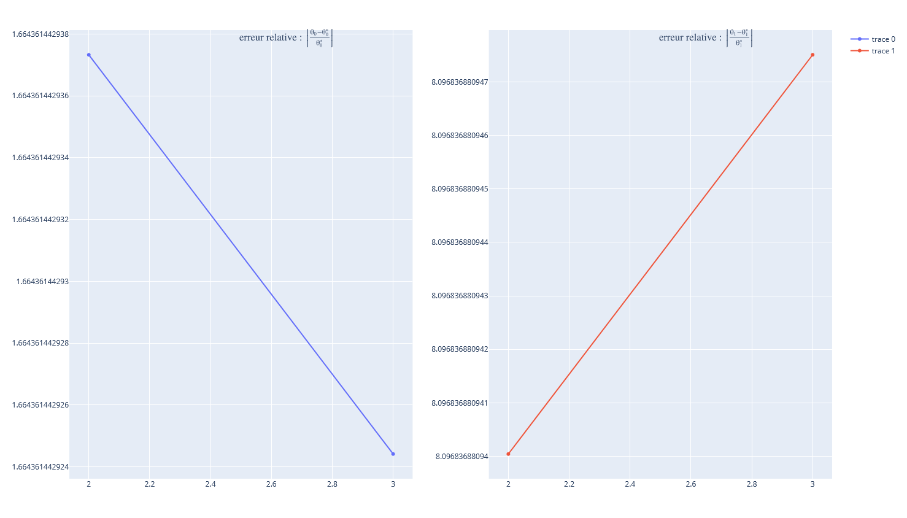
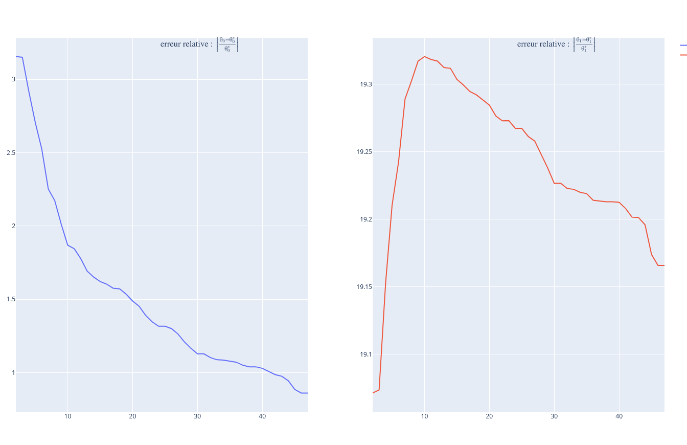
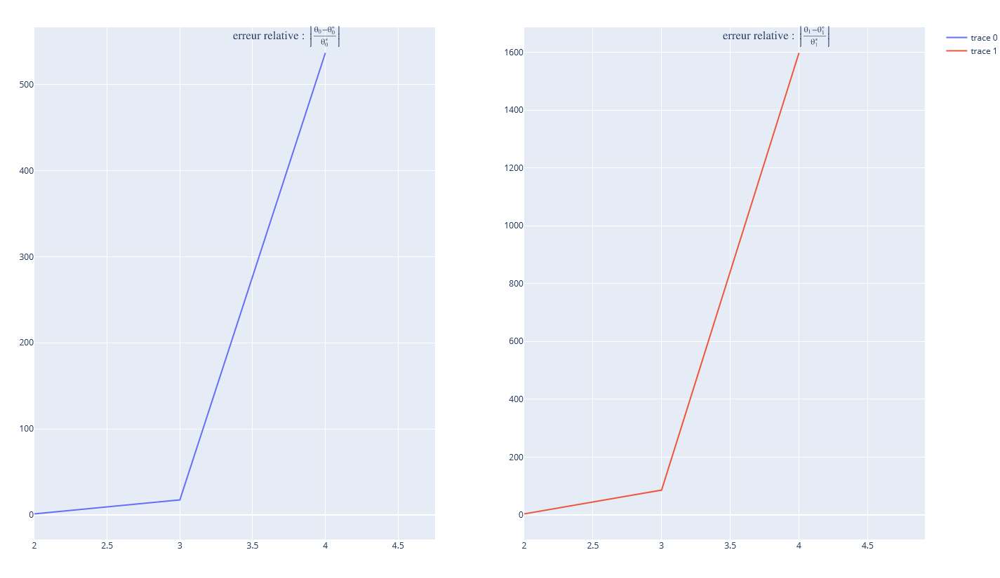

$$θ_{target} = [6.08757586 1.        ]$$

$$θ_{initial} = [2.15175956 1.        ]$$

$\theta_{200} =$ [6.06810942 1.6116315 ]

$d =$ [0.01946644 0.6116315 ]

θ_target = [-1.36981415  1.        ]

θ_initial = [-3.64337421  1.        ]

θ_200 = [-1.33478944  1.49614164]

d = [0.0350247  0.49614164]

θ_target = [-6.40298831  1.        ]

θ_initial = [-8.41548993  3.        ]

θ_200 = [-6.53783057  1.82227409]

d = [0.13484226 0.82227409]

θ_target = [-6.34366908  1.        ]

θ_initial = [-17.15068306   9.        ]

θ_2 = [-16.90166088   9.09764656]

θ_target = [-2.29869928  1.        ]

θ_initial = [-9.96588927 20.        ]

θ_46 = [-4.2780763  20.16776312]

θ_target = [-4.95929372  1.        ]

θ_initial = [3.12797858 3.        ]

θ_1 = [1.35060135 4.45164731]

θ_2 = [-91.65170757  86.68457887]

θ_3 = [2656.87459313 1598.80949203]

